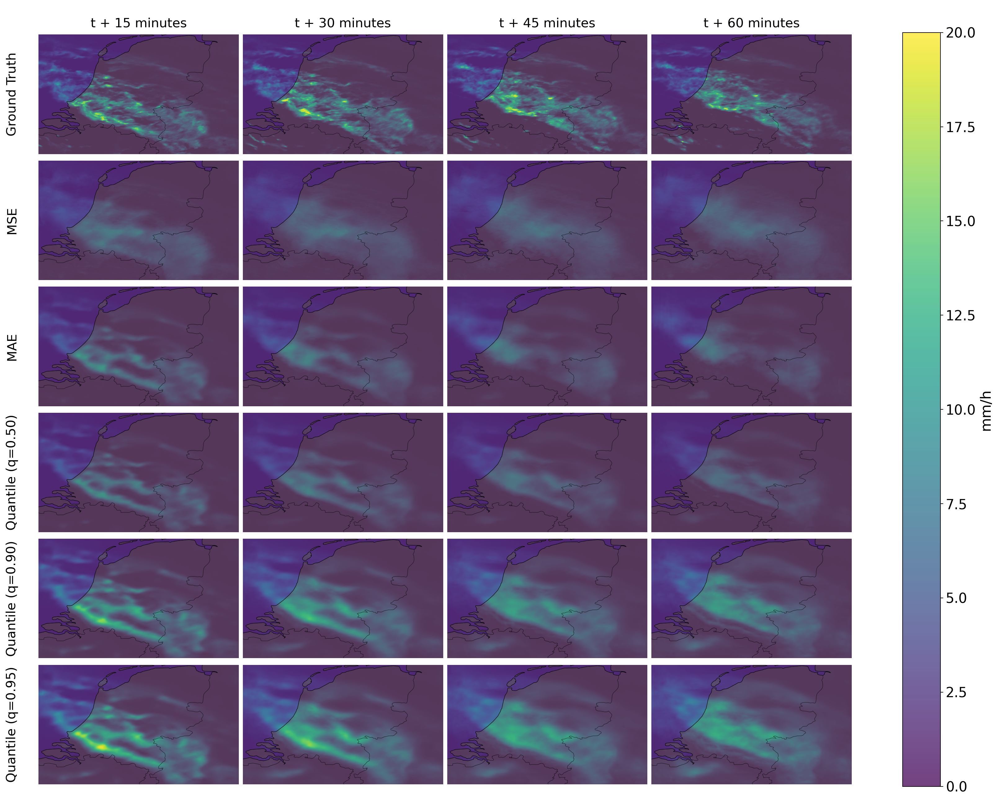

# Improving Precipitation Nowcasting with Multi-Quantile Regression

Official implementation for the paper **"THIS IS A PLACEHOLDER"** by Gijs van Nieuwkoop and Siamak Mehrkanoon.

This repository investigates whether a deterministic precipitation nowcasting architecture can be improved by changing the training objective rather than the model architecture. Using **SmaAt-UNet** as a controlled test case, the experiments compare conventional pointwise losses, namely MSE and MAE, with a **multi-quantile pinball loss**. The quantile model predicts multiple conditional quantiles of future precipitation, with the median output used as the central deterministic nowcast and higher quantiles used as risk-sensitive forecasts for heavier precipitation.

## Overview

Precipitation nowcasting is formulated as a spatiotemporal sequence prediction task. Given the most recent 90 minutes of radar precipitation maps, the model predicts precipitation maps from 5 to 60 minutes into the future.

In the default configuration:

- input sequence: 18 radar precipitation maps
- output sequence: 12 future precipitation maps
- temporal resolution: 5 minutes
- model backbone: SmaAt-UNet
- deterministic losses: MSE and MAE (`--loss mse`, `--loss l1`)
- quantile loss: multi-quantile pinball loss (`--loss quantile`)
- default quantiles: 0.50, 0.90, 0.95

<p align="center">
  
</p>

<p align="center">
  <em>Multi-quantile training setup. The SmaAt-UNet backbone predicts separate future precipitation sequences for each quantile, and the corresponding quantile-specific pinball losses are combined into a single training objective.</em>
</p>

The main entry-point scripts are:

| Script | Purpose |
| --- | --- |
| `create_datasets.py` | Generate filtered datasets as used in the paper. |
| `train.py` | Train a SmaAt-UNet-based nowcasting model. |
| `eval.py` | Evaluate a trained model on the validation or test split. |
| `eval_persistence.py` | Evaluate the persistence baseline. |
| `compare_models.py` | Compare trained models and generate summary plots/visualizations. |

## Repository structure

```text
.
├── assets/
│   ├── SmaAt-UNet quantile training.png  # Training schematic from paper
│   └── prediction_visualizations.png     # Prediction visualization from paper
├── models/
│   ├── SmaAt_UNet/                       # SmaAt-UNet backbone implementation
│   └── lightning_base.py                 # PyTorch Lightning wrapper
├── checkpoints/
│   ├── paper/                            # Weights of models used in original paper
├── util/
│   ├── callbacks.py                      # Training callbacks and visualizations
│   ├── evaluate_model.py                 # Verification metrics and prediction plots
│   ├── load_dataset.py                   # Precipitation data module
│   ├── quantile_loss.py                  # Multi-quantile pinball loss
│   └── visualization.py                  # Plotting utilities
├── create_datasets.py                    # Create filtered datasets
├── train.py                              # Train MSE, MAE, or quantile models
├── eval.py                               # Evaluate trained models
├── eval_persistence.py                   # Evaluate persistence baseline
└── compare_models.py                     # Compare models and generate paper-style figures
```

## Installation

Clone the repository and create a Python environment:

```bash
git clone <repository-url>
cd <repository-name>

python -m venv .venv
source .venv/bin/activate  # Linux/macOS
# .venv\Scripts\activate   # Windows
```

Install the required packages:

```bash
pip install -r requirements.txt
```

For GPU training, install the PyTorch version matching your CUDA setup from the official PyTorch installation instructions. The scripts automatically use a GPU when CUDA is available and fall back to CPU otherwise.

## Data

The datasets used in for model training and evaluation in the paper were created by filtering an unprocessed dataset of precipitation maps of the Netherlands and surrounding areas. This unprocessed dataset contains precipitation maps from 2016 to 2019 at 5-minute intervals, resulting in about 420,000 images. This dataset is available upon request (s.mehrkanoon@uu.nl) and can be adapted to the task formulation of the paper by processing it using `create_datasets.py`. 

The dataset created by `create_datasets.py` is compatible with `util.load_dataset.PrecipitationDataModule`, and can thus be used to call subsequent scripts:

```bash
--data-file data/precipitation_dataset.h5
```

## Pretrained paper checkpoints

The trained model checkpoints used for the paper results are provided in `checkpoints/paper/`.

```text
checkpoints/paper/
├── mse/
│   └── model.ckpt
├── mae/
│   └── model.ckpt
└── quantile/
    └── model.ckpt

## Training

Models are trained with `train.py`. The script saves training logs, checkpoints, visualizations, and a `config.json` file for each run.

### Train the multi-quantile model

```bash
python train.py \
  --data-file data/precipitation_dataset.h5 \
  --result-log-dir results \
  --loss quantile \
  --quantiles 0.5 0.9 0.95 \
  --higher-q-weight 0.5 \
  --loss-reduction sum \
  --batch-size 16 \
  --learning-rate 1e-3 \
  --max-epochs 300 \
  --es-patience 15
```

### Train an MSE baseline

```bash
python train.py \
  --data-file data/precipitation_dataset.h5 \
  --result-log-dir results \
  --loss mse \
  --loss-reduction sum \
  --batch-size 16 \
  --learning-rate 1e-3 \
  --max-epochs 300 \
  --es-patience 15
```

### Train an MAE baseline

In the code, MAE is selected using `--loss l1`.

```bash
python train.py \
  --data-file data/precipitation_dataset.h5 \
  --result-log-dir results \
  --loss l1 \
  --loss-reduction sum \
  --batch-size 16 \
  --learning-rate 1e-3 \
  --max-epochs 300 \
  --es-patience 15
```

### Training outputs

Each run is saved under a dated directory in `results/`, for example:

```text
results/
└── SmaAt_UNet_<YYYY-MM-DD>_run-1/
    ├── config.json
    ├── metrics.csv
    ├── checkpoints/
    │   └── epoch=...-val_loss=....ckpt
    └── ...
```

For evaluation and comparison, it is convenient to collect the best checkpoint of each model in a separate comparison folder. The evaluation scripts expect the checkpoint and `config.json` to be in the same model directory.

Suggested structure:

```text
results/comparison/
├── mse/
│   ├── model.ckpt
│   └── config.json
├── mae/
│   ├── model.ckpt
│   └── config.json
└── quantile/
    ├── model.ckpt
    └── config.json
```

## Evaluation

Evaluate a trained model using `eval.py`:

```bash
python eval.py \
  --model-path results/comparison/quantile/model.ckpt \
  --data-file data/precipitation_dataset.h5 \
  --evaluation-set test \
  --precipitation-thresholds 0.5 10.0 20.0
```

This writes the results to the model directory by default:

```text
results/comparison/quantile/
├── model.ckpt
├── config.json
├── test_results.json
└── test_predictions.png
```

The JSON file contains continuous regression metrics and threshold-based verification metrics, including CSI, POD, FAR, and MCC, for each precipitation threshold.

To evaluate the validation split instead, use:

```bash
python eval.py \
  --model-path results/comparison/quantile/model.ckpt \
  --data-file data/precipitation_dataset.h5 \
  --evaluation-set val
```

## Persistence baseline

The persistence baseline predicts future precipitation by persisting the latest observed input frame. Evaluate it with:

```bash
python eval_persistence.py \
  --data-file data/precipitation_dataset.h5 \
  --output-dir results/comparison/persistence \
  --evaluation-set test \
  --precipitation-thresholds 0.5 10.0 20.0
```

This produces:

```text
results/comparison/persistence/
└── test_results.json
```

## Comparing models

After evaluating the trained models and persistence baseline, compare them with `compare_models.py`:

```bash
python compare_models.py \
  --model-folder results/comparison \
  --data-file data/precipitation_dataset.h5 \
  --dataset test \
  --thresholds 0.5 10.0 20.0 \
  --output-folder results/comparison
```

This script:

1. prints metric tables for each precipitation threshold;
2. plots CSI across forecast lead times;
3. visualizes predictions for selected samples and lead times.

Generated outputs include:

```text
results/comparison/
├── csi_across_lead_times.png
├── test_<sample-index>_predictions.png
└── ...
```

You can customize the plotted samples and lead times:

```bash
python compare_models.py \
  --model-folder results/comparison \
  --data-file data/precipitation_dataset.h5 \
  --dataset test \
  --sample-indices 444 750 777 1321 1333 \
  --lead-time-indices 2 5 8 11
```

With 5-minute output intervals, the default lead-time indices `2 5 8 11` correspond to 15, 30, 45, and 60 minutes ahead.

## Reproducing the paper workflow

A typical reproduction workflow is:

```bash
# 1. Train models
python train.py --data-file data/precipitation_dataset.h5 --loss mse      --result-log-dir results
python train.py --data-file data/precipitation_dataset.h5 --loss l1       --result-log-dir results
python train.py --data-file data/precipitation_dataset.h5 --loss quantile --result-log-dir results

# 2. Copy the best checkpoint from each run into results/comparison/<model-name>/model.ckpt
#    and copy the corresponding config.json into the same folder.

# 3. Evaluate trained models
python eval.py --model-path results/comparison/mse/model.ckpt      --data-file data/precipitation_dataset.h5 --evaluation-set test
python eval.py --model-path results/comparison/mae/model.ckpt      --data-file data/precipitation_dataset.h5 --evaluation-set test
python eval.py --model-path results/comparison/quantile/model.ckpt --data-file data/precipitation_dataset.h5 --evaluation-set test

# 4. Evaluate persistence
python eval_persistence.py --data-file data/precipitation_dataset.h5 --output-dir results/comparison/persistence --evaluation-set test

# 5. Compare models
python compare_models.py --model-folder results/comparison --data-file data/precipitation_dataset.h5 --dataset test
```

For the experiments reported in the paper, the same architecture is used across losses, with differences limited to the output dimensionality and training objective. The quantile model uses the median output (`q = 0.50`) as the central deterministic forecast, while the `q = 0.90` and `q = 0.95` outputs provide upper-tail forecasts for risk-sensitive prediction.

## Results summary

The paper finds that multi-quantile training improves the central deterministic forecast compared with MSE and MAE training, while also producing upper-quantile outputs that are useful for heavy-precipitation prediction.

In the reported test-set results, the quantile model obtains the lowest regression errors:

| Training loss | Test MSE | Test MAE |
| --- | ---: | ---: |
| MSE | 0.0151 | 0.0424 |
| MAE | 0.0161 | 0.0348 |
| Quantile | **0.0138** | **0.0345** |

At higher precipitation thresholds, the upper quantile outputs increase detection of heavy precipitation events, at the cost of more false alarms. This makes them useful for applications where missed heavy-rainfall events are especially costly.

<p align="center">
  
</p>

<p align="center">
  <em>Qualitative comparison of ground-truth precipitation and model predictions at selected forecast lead times. The upper-quantile outputs predict broader and more intense precipitation regions, reflecting their risk-sensitive behavior for heavy precipitation.</em>
</p>

## Acknowledgements

This repository builds on the SmaAt-UNet architecture for precipitation nowcasting:

- Kevin Trebing, Tomasz Stańczyk, and Siamak Mehrkanoon, **SmaAt-UNet: Precipitation Nowcasting using a Small Attention-UNet Architecture**, *Pattern Recognition Letters*, 2021.
- Original SmaAt-UNet repository: <https://github.com/HansBambel/SmaAt-UNet>

## Citation

If you use this code, please cite the accompanying paper:

```
PLACEHOLDER
```

Please also cite SmaAt-UNet if you use the architecture:

```bibtex
@article{trebing2021smaat,
  title={SmaAt-UNet: Precipitation nowcasting using a small attention-UNet architecture},
  author={Trebing, Kevin and Staǹczyk, Tomasz and Mehrkanoon, Siamak},
  journal={Pattern Recognition Letters},
  volume={145},
  pages={178--186},
  year={2021},
  publisher={Elsevier}
}
```
